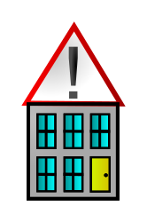

<h1>Info ohutuse kohta</h1>

Lehel ohutus.github.io leiad huvitavat infot ohutuse kohta, mida kuskilt mujalt ei leia! 
<button id="teinefakt" style="padding: 10px; color: black; background-color: lightgreen; font-size: 25px; border-radius: 10px; border-style: none;">Huvitavad faktid &rarr;</button>

